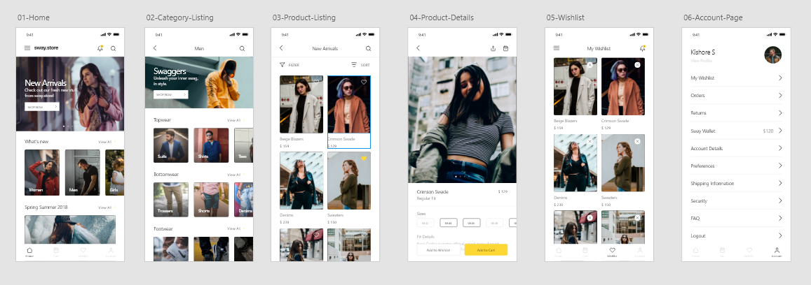

# neko-sway-store

- React native with expo, Front UI
- navi: https://reactnavigation.org/docs/en/getting-started.html

## Install

- yarn add react-navigation
- expo install react-native-gesture-handler react-native-reanimated react-native-screens react-native-safe-area-context
- yarn add react-navigation-stack react-navigation-tabs
- yarn add @react-native-community/masked-view

## Etc

- navigation.navigate('Name');
- navigation.navigate('Name', item);
- navigation.goBack();
- navigation.openDrawer();

## Design Licensed by ?

- https://project365.design/

**Cut**
---

